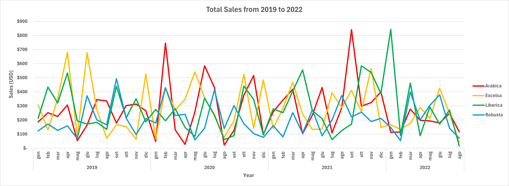
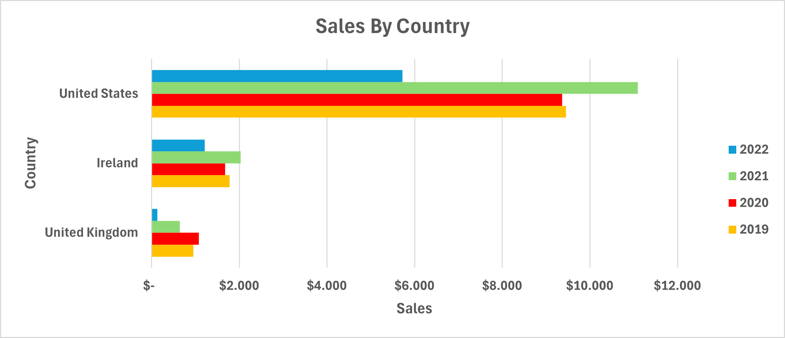
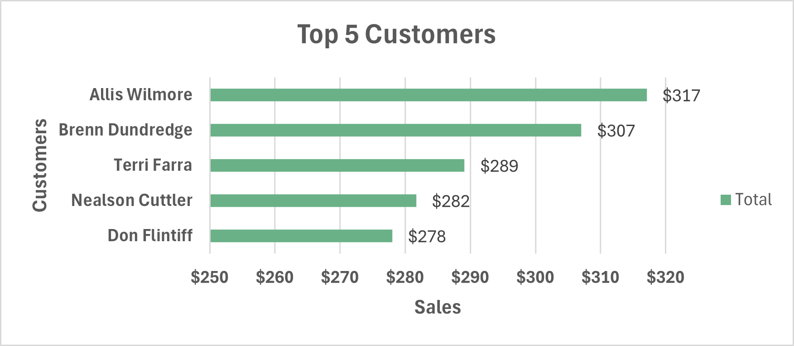
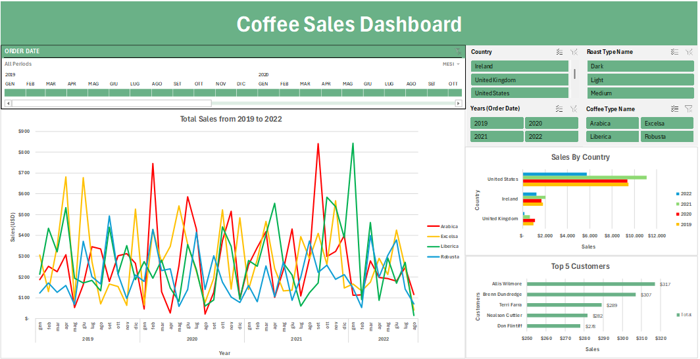

# Coffee Sales Analysis Project 

## Introduction

This project analyzes coffee beans sales data from 2019 to 2022 to identify key sales trends across different coffee types, understand customers behaviors, and pinpoint high-performing countries. The insights delivered from this analysis can help stakeholders make data-driven decisions. The entire analysis was performed using Excel, including data cleaning, exploration, and the creation of an interactive dashboard.

## Objectives

1.	**Data Integration and Cleaning:** 
    + Merge data from three different tables into a comprehensive _Orders_ Table using `XLOOKUP()` and `INDEX-MATCH()` functions. 
    + Ensure data integrity by addressing duplicates, errors, and inconsistencies.  
2.	**Sales Trends Analysis:** 
    + Examine sales trends over time, top-performing coffee type, and geographic distribution to uncover growth opportunities and market challenges.
3.	**Interactive Dashboard:** 
  	+ Summarize findings in a visually engaging Excel dashboard that enables dynamic exploration of key insights.

## Dataset Overview

**Dataset:** [CoffeeSales]( https://github.com/elenatassotti/Coffee-Sales-Analysis-Project/blob/main/OrdersTable.xlsx)

The original dataset consists of three tables (_Orders_, _Customers_, _Products_). A comprehensive _Orders_ table was created merging the tables and contains the following fields: 

+ Order ID,
+ Order Date,
+ Customer ID,
+ Product ID,
+ Quantity,
+ Customer Name,
+ Email,
+ Country,
+ Coffee Type,
+ Coffee Type Name,
+ Roast Type,
+ Roast Type Name,
+ Size,
+ Unit Price,
+ Sales, 
+ Loyalty Card.
  
## Process

### Populating the _Orders_ Table

Before performing any cleaning procedure, I populate the _Orders_ table by retrieving customers and products details from the related tables.

1. **Customer Information**

    To populate the _Customer Name_, _Email_ and _Country_ columns, I decide to use the `XLOOKUP()` function, as it provides greater flexibility compared to `VLOOKUP()` when dealing with non-sequentially 
    arranged data. 
    
    #### Customer Name
    
    I use the following formula to retrieve customer names:
    
    `=XLOOKUP(C2;customers_raw!$A$1:$A$1001;customers_raw!$B$1:$B$1001;””;0)`
    
    + it retrieves the customer name based on the Customer ID, contained in cell _C2_,
    + if no match is found, it returns a blank value (“”) instead of an error.

    #### Email
    
    By default, `XLOOKUP` returns `0` if the array contains  a blank cell. To have in the output a blank cell, I use an `IF()` function with a nested `XLOOKUP()`, as follows: 
    
    `=IF(XLOOKUP(OrdersTable!C2;customers_raw!$A$1:$A$1001;customers_raw!$C$1:$C$1001;;0)=0;"";XLOOKUP(OrdersTable!C2;customers_raw!$A$1:$A$1001;customers_raw!$C$1:$C$1001;;0))`
    
    #### Country 
    
    For the _Country_ column, I use the following formula:
    
    `=XLOOKUP(C2;customers_raw!$A$1:$A$1001;customers_raw!$G$1:$G$1001;;0).`

2. **Product Information**

    For attributes such as _Coffee Type_, _Roast Type_, Size_, and _Unit Price_, I use the `INDEX-MATCH()` function. Since the data in the _Products_ table is organized sequentially, this function is a 
    more flexible and efficient alternative to the `XLOOKUP()` used so far.
    The formula used to retrieve the product information is:
   
    `=INDEX(products_raw!$A$1:$G$49;MATCH(Orders!$D2;products_raw!$A$1:$A$49;0);MATCH(Orders!I$1;products_raw!$A$1:$G$1;0))`
   
    In this approach, the `MATCH()` function finds the row and column numbers of the  required value in the _products_raw_ table. Then, `INDEX()` dynamically retrieves the corresponding data.

3. **Sales Column Calculation**

    I calculate the _Sales_ column by multiplying the _Quantity_ and _Unit Price_ columns.

4. **Adding the Loyalty Card Column**

    To enhance customer segmentation, I retrieve once again the data from the _Customers_ table using the following formula:
    
    `=XLOOKUP(C2;customers_raw!$A$1:$A$1001;customers_raw!$I$1:$I$1001;;0)`.

### Data Cleaning

To ensure data accuracy and consistency, I performe the following steps:

1.	**Duplicates Removal:** Used Excel’s _Remove Duplicates_ feature to check for redundant records.
	
2.	**Improving Data Clarity:** To enhance readability, replaced abbreviations with their full forms. “Rob”, “Exc”, “Ara”, and “Lib” are substituted with “Robusta”, “Excelsa”, “Arabica” and “Liberica” in the _Coffee Type_ column and “M”, “L”, and “D” with “Medium”, “Light”, “Dark” in the _Roast Type_ column.
   
    For the _Coffee Type_ column, I performe the replacement using the following formula: 
    
    `=IF(I2="Rob";"Robusta";IF(I2="Exc";"Excelsa";IF(I2="Ara";"Arabica";IF(I2="Lib";"Liberica";""))))`
    
    And for the _Roast Type_ column, with the following one:
    
    `=IF(K2="M";"Medium";IF(K2="L";"Light";IF(K2="D";"Dark";"")))`.

3.	**Data Formatting:**
   
    + **Order Date:** formatted as dd-mmm-yyyy for clarity,
    + **Size:** customized  format to display the measurement unit (kg),
    + **Unit Price & Sales:** I assigne the correct currency format. 

4.	**Filtering for Anomalies:** To detect potential outliers and inconsistencies, I converte the dataset into an Excel table. This allows me to efficiently filter and inspect data for any irregularities. 

### Exploratory Data Analysis (EDA)

The following analysis are conducted using PivotTables and charts:

1.	**Total Sales Over Time by Coffee Type:** A line chart visualizes sale trends for each coffee type over the years. To focus on a specific time frame, I added an interactive timeline. 

2.	**Year-over-Year (YoY) Growth Analysis:** a PivotTable helped me calculate the YoY growth rates for total sales to identify period of significant change. I created the _YoYGrowth %_ column following these steps: 

    + added a second _Sales_ column,
    + right-clicking on it -> Show Values As -> % Distance From
    + Selected as Base Field -> Year and Base Item -> (Previous)

    This new column will automatically calculate the Year-Over-Year % change.

3.	**Sales Distribution Over Time by Country:** to analyze how each country contributed to the total coffee sales, I created a clustered bar chart.  

4.	**Top 5 Customers & Loyalty Program Analysis:** I created a bar chart to display the top 5 customers based on total sales and analyzed the impact of the loyalty program on sales.
    
## Results and Key Insights

### Total Sales Over Time by Coffee Type:

1.	**Sales Volatility:** Sales for all coffee types fluctuate significantly over time, with multiple peaks and drops throughout the years.
   
2.	**Top Performing Coffee Types:** Arabica and Liberica coffees are top sellers, suggesting a focus on these varieties. Arabica has sharp sales spikes around mid-2020 and early 2022 and Liberica from 2021 to beginning of 2022 with a small drop during mid-2021.
   
3.	**Least Performing Coffee Type:** Robusta shows lower sales compared to the other data types, presenting almost no peaks.
   
4.	**Decline of Sales in 2022:** There is an overall drop of sales for all coffee towards the end of 2022. Potential factors include increased competition, changing customer preferences, or economic downturn. 

### Year-over-Year Growth Analysis

The following table shows the YoY over time:

| Years | Total Sales | YoY % Growth |
| ------- |:--------------:| -------------------:|
| 2019  |     $ 12.187|             -              |
| 2020  |     $ 12.118|                 -0.6% |
| 2021  |     $ 13.766|              +13.6% |
| 2022  |      $ 7.063 |              -48.7%  |

1.	2020 saw a minor decline (-0.6%), but 2022 faced a major drop (-48.7%), requiring further investigation.
   
2.	2021 experienced strong growth (+13.6%).

### Sales by Country:

1.	**Dominance of United States:** the United States consistently represent the largest market. In particular, with a peak of over $ 11.000, 2021 was the most successful year for the American market.
   
2.	**Impact of Time:** Performances in all three countries are significantly lower during 2022, this might indicate that time-related factors are significantly influencing the sales.
	
3.	**United Kingdom Struggles:** Sales are overall low across all years compared to other countries with a much more evident decline from 2021 to 2022. 

### Top 5 Customers & Loyalty Program Analysis:

Loyalty members generate a higher revenue, indicating that expanding incentives may boost retention. Indeed, 54% of customers have a loyalty card. 

## Interactive Dashboard

An interactive dashboard was created in Excel, incorporating slicers for Coffee Type, Roast Type, Size, and Country, enabling dynamic exploration of the data. It also includes the charts and tables described above. 

## Conclusions 

+ Arabica and Liberica coffee types appear as the most popular and profitable coffee types. Although Excelsa appears more consistent, both Excelsa and Robusta need new strategies to improve their sales.

+ Ireland present a niche opportunity for Excelsa coffee, proved by sales peaks in early 2022.  More sales strategies need to be tailored.

+ United States remain the biggest market. The country dominates sales over the targeted time frame. Continuous investments in this region are then recommended. 

+ Loyalty programs drive revenue, indeed, expanding them could improve retention.

+ The 2022 sales decline requires further investigation, performing a root cause analysis is required. External factors such as competition, economic conditions, or shifting customer preferences should be examined.

The Excel interactive dashboard is available here: [CoffeeSalesDashboard]( https://github.com/elenatassotti/Coffee-Sales-Analysis-Project/blob/main/CoffeeSalesDashboard.xlsx).

